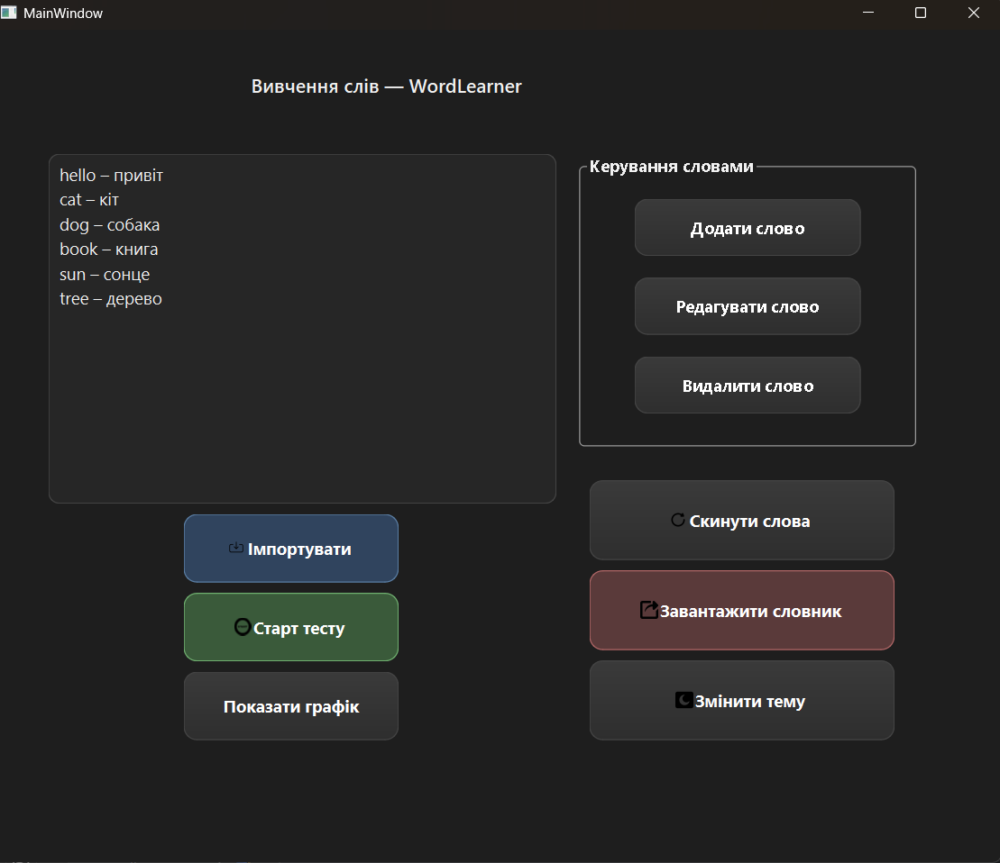
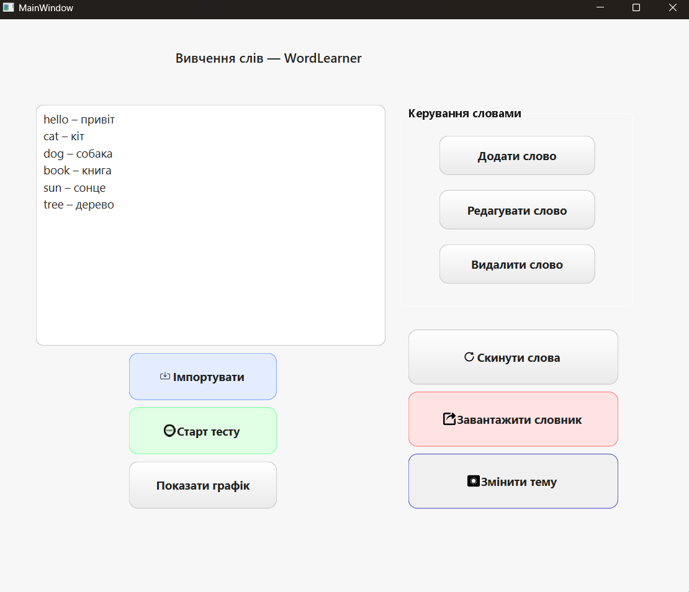
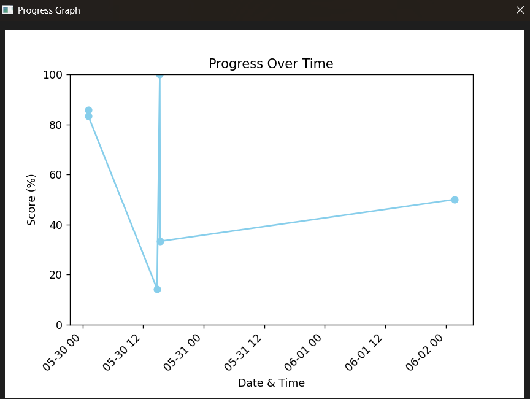
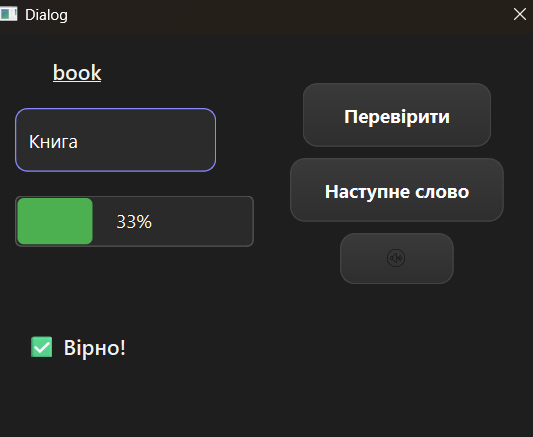

# Wordlearner (Python / PySide6)
Application for learning foreign words with a modern Qt-based GUI (PySide6). Includes interactive quizzes, progress tracking, import/export, and detailed statistics — built as a course project.


---

## ✨ Project Description

**Wordlearner** is an application for learning foreign words with a modern graphical interface powered by **Qt** (PySide6).

- 🎯 Interactive quizzes
- 📈 Progress tracking
- 🔄 Import/export data in JSON format
- 📊 Detailed learning statistics

This project was developed as a coursework project combining Python, PySide6, and Qt architecture skills.

---

## 📸 Interface Screenshots

| Dark Theme                                 | Light Theme                                |
|-------------------------------------------|-------------------------------------------|
|         |       |

| Graph Window                               | Quiz Window                                |
|-------------------------------------------|-------------------------------------------|
|   |     |

---

## 💻 Technologies

- **Language:** Python 3.11+
- **Framework:** PySide6 (Qt for Python)
- **Data Storage:** JSON files
- **IDE:** PyCharm 2024.3.5
- **UI Tools:** Qt Designer, pyside6-uic

---

## ⚙️ How to Run

1. Clone the repository:
    ```bash
    git clone https://github.com/snakyv/Wordlearner.git
    ```

2. Install dependencies:
    ```bash
    pip install -r requirements.txt
    ```

3. Run the application:
    ```bash
    python main.py
    ```

---

## ✉️ Author

**Vitalii Zadorozhnyi**  
Specialty: 126 — Information Systems and Technologies  
Year: 2025  
University: Odesa, Ukraine

---

⭐ If you like the project — star ⭐ the repository and follow my profile!
